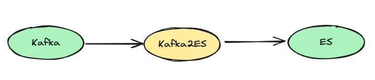

# Kafka2ES

Kafka2ES 是一个从Kafka读取消息，按照配置的格式化规则进行处理，然后写入的ElasticSearch集群的工具。

### 安装

```shell
cd src && go build -o kafka2es main.go
```
### Quick Start

- 可执行文件方式

```shell
./kafka2es
```

- docker 方式，确保配置文件路径正确 [部署在了阿里云容器里]

```shell
docker run -d -v `pwd`/src/etc:/app/etc registry.cn-beijing.aliyuncs.com/whoops/kafka2es:v1.0
```
### 目录介绍
- src [主要代码逻辑]
  - api[http路由相关信息]
  - cmd[程序入口函数]
  - es_proxy[输出组件es的相关操作]
  - etc[配置文件]
  - format[格式化相关操作]
  - handle[Kafka-handler-ES的逻辑代码]
  - kafka_proxy[输入组件kafka的相关操作]
  - logger[日志相关操作]
  - model[一些常量信息]
- main.go [函数执行入口]
